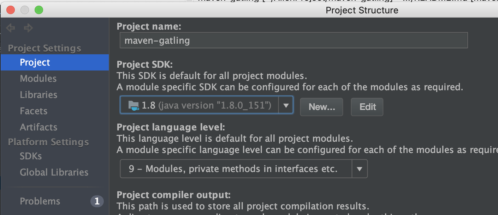
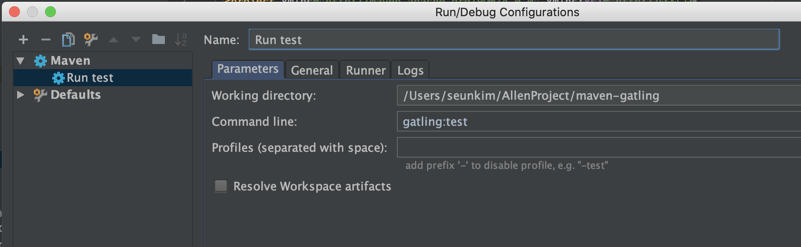

# maven-gatling
Load test project using Gatling

## Install initial project with maven archetype

We are going to install the initial project with maven archetype.

First, run the maven command to generate the archetype.

```bash
$ mvn archetype:generate -DarchetypeGroupId=io.gatling.highcharts -DarchetypeArtifactId=gatling-highcharts-maven-archetype
```
> To run this command, you need to install `maven` in your env.

You need to add `groupId` and `artifactId` for your project.

```console
Define value for property 'groupId': coolexplorer.github.io
Define value for property 'artifactId': maven-gatling 
Define value for property 'version' 1.0-SNAPSHOT: : 0.1.0-SNAPSHOT
Define value for property 'package' coolexplorer.github.io: : 
```

Then, can see the `src/test` tree and `pom.xml` for Gatling.

```console
.
├── LICENSE
├── README.md
├── maven-gatling.iml
├── pom.xml
└── src
    └── test
        ├── resources
        │   ├── bodies
        │   ├── data
        │   ├── gatling.conf
        │   ├── logback.xml
        │   └── recorder.conf
        └── scala
            ├── Engine.scala
            ├── IDEPathHelper.scala
            └── Recorder.scala

6 directories, 10 files
```

### IDE Setting

To run the test on the local environment, I'm going to use `Intellij` from Jetbrain.

Gatling offer DSL based on the scala, so need to install Java to build the gatling project.



Run the Maven project to get the plugins from the `pom.xml` file.
 


Add the gatling command to run the script.

