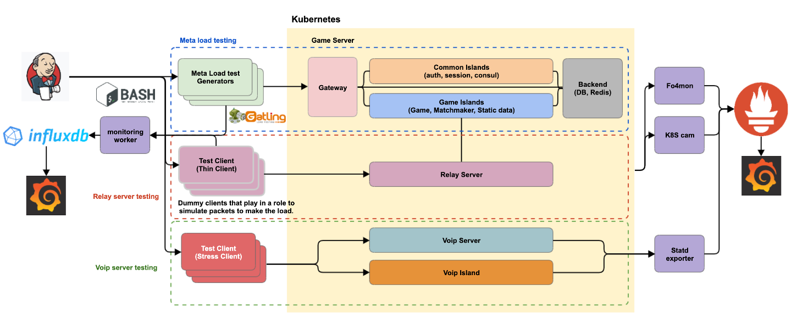

# maven-gatling
Load test project using Gatling

## What is Gatling?

Gatling is a highly capable load testing tool. It is designed for ease of use, maintainability and high performance.

Out of the box, Gatling comes with excellent support of the HTTP protocol that makes it a tool of choice for load 
testing any HTTP server. As the core engine is actually protocol agnostic, it is perfectly possible to implement support for other protocols. For example, Gatling currently also ships JMS support.

## Why choose Gatling?

I am the Software Quality Engineer at Electronic Arts Korea who is in charge of the test of our game server reliability and availability. Gatling has the Enterprise version called Gatling Frontline but an open source version is powerful to test as well. But there is no various documents to refer to set up the load test environment. So, I'm going to write down my experience of what I've done when I tested the our game server. 

## What is my goal?

I'm going to set up the total load test environment to use varios tools. In this repository, make the basic load test script and load test profiles to use when you run it with CI/CD tools like Jenkins. 

## Documentation

In this project, I'm going to write the all progress to create the simple Gatling project. You can see the all steps 
below links.

| Category         |                         Link                     |
|------------------|--------------------------------------------------|
| Project Creation | [project-creation](docs/project-creation.md) |
| Upgrade Gatling version | [Upgrade-gatling-3.5.1](docs/upgrade-gatling-3.5.1.md) |
| Simple Simulation | [simple-simulation](docs/simple-simulation.md) |
| Create Github Action for docker image | [Github-Action-docker](docs/github-action-docker.md) |

## Authors
- Allen Kim - Initial work - [coolexplorer](https://github.com/coolexplorer)

## License

This project is licensed under the MIT License - see the [LICENSE.md](LICENSE.md) file for details
