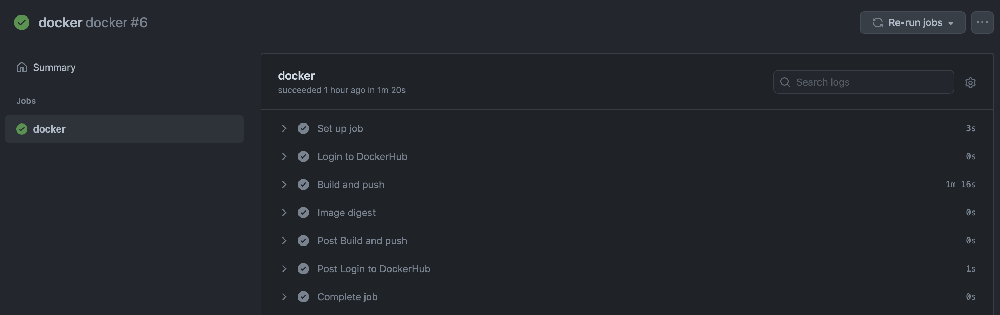

# Set Github action for building docker image

If you want to run this project with many generators, using the docker container is the best option for that. In this document, I'm going to write the way to set up [`Github action`](https://docs.github.com/en/actions/learn-github-actions) to build the docker image. 

## What is Github Action?

GitHub Actions help you automate tasks within your software development life cycle. GitHub Actions are event-driven, meaning that you can run a series of commands after a specified event has occurred. For example, every time someone creates a pull request for a repository, you can automatically run a command that executes a software testing script.


## Add Github action yaml script

I've created my script file simply using the [`Build and push Docker images`](https://github.com/marketplace/actions/build-and-push-docker-images) in the Github marketplace. 

Added only 3 steps for building docker - Login dockerbug, Build and push, and Image digest.

And changed the `on` option to `published` and `watch started` status. This means that this action will be triggered when you release your project and check the star for your porject. `watch started` is for manual trigger. This is a quite good trick when you debug your script.

Make sure that you add the `DOCKER_USERNAME` and `DOCKER_PASSWORD` in `Secrets` of your project setting. (Project main > Settings > Secrets)

```yaml
name: docker

on:
  release:
    types: [published]
  watch:
    types: [started]

jobs:
  docker:
    runs-on: ubuntu-latest
    steps:
      -
        name: Login to DockerHub
        uses: docker/login-action@v1 
        with:
          username: ${{ secrets.DOCKER_USERNAME }}
          password: ${{ secrets.DOCKER_PASSWORD }}
      -
        name: Build and push
        id: docker_build
        uses: docker/build-push-action@v2
        with:
          push: true
          tags: $GITHUB_REPOSITORY:latest
      -
        name: Image digest
        run: echo ${{ steps.docker_build.outputs.digest }}
```

