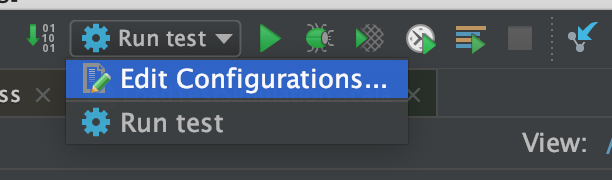
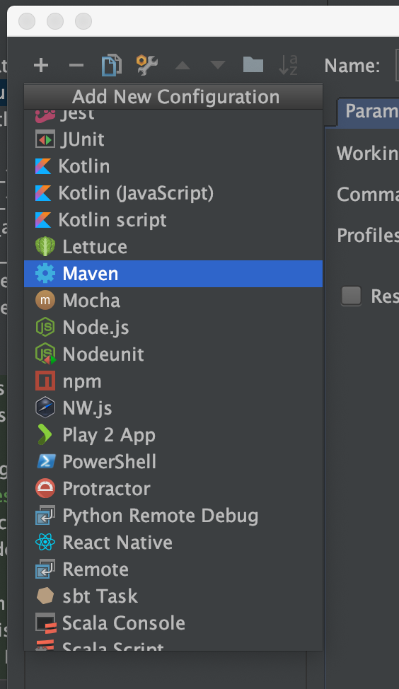
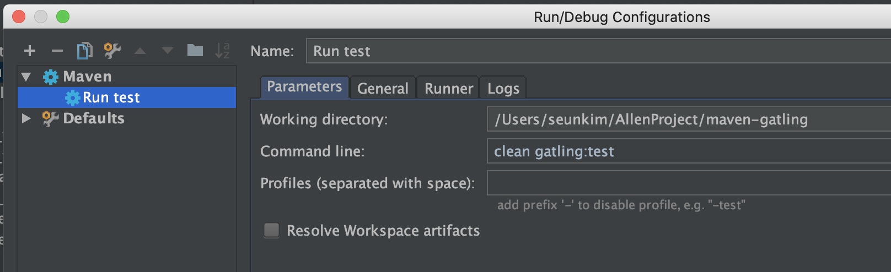

# Simple simulation
You should add the `simulation` to run the load test after the project creation. 

We don't have any server to test right now, so I'm going to use dummy api heading to `https://www.google.com`.

## Simulation Creation

Inherit `Simulation` class of Gatling for your own Simulation. And add `setUp()` to inject the this simulation
into Gatling engine.

To use the Http API like CRUD, you need to set up the Http protocol in advance. 
Http Protocol defines a target server, headers, and other options for all APIs Gatling is calling during the test.

I'm going to add `Google url` for target server and `content-type: application/json` as a header.

Below is the simple simulation class for our load test. 

```scala
import io.gatling.core.Predef._
import io.gatling.http.Predef._
import io.gatling.http.HeaderNames
import io.gatling.http.protocol.HttpProtocolBuilder
import scala.concurrent.duration._

class LoadTestSimulation extends Simulation {
  def createHttpProtocol(): HttpProtocolBuilder = {
      http
        .baseUrls("https://www.google.com")
        .acceptHeader("*/*")
        .headers(Map(
          HeaderNames.ContentType -> "application/json"
        ))
        .disableWarmUp
        .disableCaching
    }
  
  setUp(
      List(
            scenario("Dummy Scenario")
              .feed(Iterator.continually(Map("username" -> "dummy")))
              .during(1 minutes) {
                exec(
                  http("Dummy Request").get("")
                ).pause(5 seconds)
              }
              .inject(rampUsers(1).during(10 seconds)).protocols(createHttpProtocol())
          )
  ).maxDuration(10 minutes)
  .assertions(
    global.responseTime.max.lt(30000),
    global.responseTime.mean.lt(1000),
    global.successfulRequests.percent.gt(90)
  )
}
``` 

## Run the load test

### Using command line
You can easily run the load test using maven command like below.

> You need to install maven on your system if you want to run this on command line. 

```bash
$ mvn gatling:test
```

### Using Intellij 

1. Open Run/Debug Configurations.  


2. Select `maven` via `+` button.  


3. Fill in name and command like below.  

